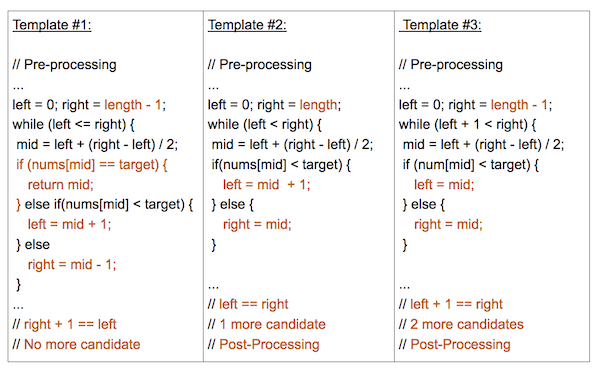

## 什么是二分搜索

二分查找是计算机科学中最基本、最有用的算法之一。 它描述了在有序集合中搜索特定值的过程。

> 二分查找中使用的术语：
>
> - 目标 Target —— 你要查找的值
> - 索引 Index —— 你要查找的当前位置
> - 左、右指示符 Left，Right —— 我们用来维持查找空间的指标
> - 中间指示符 Mid —— 我们用来应用条件来确定我们应该向左查找还是向右查找的索引

## 典型示例

[704. 二分查找](https://leetcode-cn.com/problems/binary-search/)

> 给定一个  `n`  个元素有序的（升序）整型数组  `nums` 和一个目标值  `target`  ，写一个函数搜索  `nums`  中的 `target`，如果目标值存在返回下标，否则返回 `-1`。

```java
class Solution {
    public int search(int[] nums, int target) {
        int left = 0, right = nums.length - 1;
        while (left + 1 < right) {
            int mid = left + (right - left) / 2;
            if (nums[mid] < target) {
                left = mid;
            } else if (nums[mid] > target) {
                right = mid;
            } else {
                return mid;
            }
        }
        if (nums[left] == target) {
            return left;
        } else if (nums[right] == target) {
            return right;
        } else {
            return -1;
        }
    }
}
```

之前学的比较粗糙，没仔细研究过二分（不就是求中间值 mid 然后判断大小再移动左右边界这么简单嘛 :joy: ，实际上并不是）。我猜大家刚开始刷二分的题目时一定经常被边界处理问题给卡住，然后看别人的题解，各种不同的初始化 `left = 0, right = nums.length` , `left = 0, right = nums.length - 1` 然后在循环体里，各种 `left = mid` , `left = mid + 1`, `right = mid`, `right = mid - 1`, 不知道用哪个，其实都是有固定套路的。

从 [LeetBook](https://leetcode-cn.com/leetbook/read/binary-search/xewjg7/) 扒来的模板



在网上看到的 99% 的二分查找问题会归结于这 3 个模板中的一个。这 3 个模板的不同之处在于：

- 左、中、右索引的分配。
- 循环或递归终止条件。
- 后处理的必要性。

模板 #1 和 #3 是最常用的，几乎所有二分查找问题都可以用其中之一轻松实现。模板 #2 更 高级一些，用于解决某些类型的问题。

## 常见题目

### 34. 在排序数组中查找元素的第一个和最后一个位置

[题目链接](https://leetcode-cn.com/problems/find-first-and-last-position-of-element-in-sorted-array/)

> 给定一个按照升序排列的整数数组 `nums`，和一个目标值 `target`。找出给定目标值在数组中的开始位置和结束位置。
> 如果数组中不存在目标值 `target`，返回  `[-1, -1]`。

```java
class Solution {
    public int[] searchRange(int[] nums, int target) {
        int n = nums.length;
        int[] ret = new int[]{-1, -1};
        if (n == 0) {
            return ret;
        }
        int left = 0, right = n - 1;
        while (left + 1 < right) {
            int mid = left + (right - left) / 2;
            if (nums[mid] < target) {
                left = mid;
            } else if (nums[mid] > target) {
                right = mid;
            } else {
                right = mid;
            }
        }
        if (nums[left] == target) {
            ret[0] = left;
        } else if (nums[right] == target) {
            ret[0] = right;
        } else {
            return ret;
        }
        left = 0;
        right = n - 1;
        while (left + 1 < right) {
            int mid = left + (right - left) / 2;
            if (nums[mid] < target) {
                left = mid;
            } else if (nums[mid] > target) {
                right = mid;
            } else {
                left = mid;
            }
        }
        if (nums[right] == target) {
            ret[1] = right;
        } else if (nums[left] == target) {
            ret[1] = left;
        }
        return ret;
    }
}
```

### 35. 搜索插入位置

[题目链接](https://leetcode-cn.com/problems/search-insert-position/)

> 给定一个排序数组和一个目标值，在数组中找到目标值，并返回其索引。如果目标值不存在于数组中，返回它将会被按顺序插入的位置。
> 你可以假设数组中无重复元素。

```java
class Solution {
    public int searchInsert(int[] nums, int target) {
        int left = 0, right = nums.length - 1;
        while (left + 1 < right) {
            int mid = left + (right - left) / 2;
            if (nums[mid] < target) {
                left = mid;
            } else if (nums[mid] > target) {
                right = mid;
            } else {
                return mid;
            }
        }
        if (nums[left] >= target) {
            return left;
        } else if (nums[right] >= target) {
            return right;
        }
        return nums.length;
    }
}
```

### 74. 搜索二维矩阵

[题目链接](https://leetcode-cn.com/problems/search-a-2d-matrix/)

> 编写一个高效的算法来判断 m x n 矩阵中，是否存在一个目标值。该矩阵具有如下特性：
>
> - 每行中的整数从左到右按升序排列。
> - 每行的第一个整数大于前一行的最后一个整数。

思路：把二维压缩成一维然后二分。

```java
class Solution {
    public boolean searchMatrix(int[][] matrix, int target) {
        if (matrix == null || matrix.length == 0 || matrix[0].length == 0) {
            return false;
        }
        int n = matrix.length, m = matrix[0].length;
        int left = 0, right = n * m - 1;
        while (left + 1 < right) {
            int mid = left + (right - left) / 2;
            int i = mid / m, j = mid % m;
            if (matrix[i][j] < target) {
                left = mid;
            } else if (matrix[i][j] > target) {
                right = mid;
            } else {
                return true;
            }
        }
        return matrix[left / m][left % m] == target || matrix[right / m][right % m] == target;
    }
}
```

### 278. 第一个错误的版本

[题目链接](https://leetcode-cn.com/problems/first-bad-version/)

> 你是产品经理，目前正在带领一个团队开发新的产品。不幸的是，你的产品的最新版本没有通过质量检测。由于每个版本都是基于之前的版本开发的，所以错误的版本之后的所有版本都是错的。
> 假设你有 `n` 个版本 `[1, 2, ..., n]`，你想找出导致之后所有版本出错的第一个错误的版本。
> 你可以通过调用 `bool isBadVersion(version)` 接口来判断版本号 `version` 是否在单元测试中出错。实现一个函数来查找第一个错误的版本。你应该尽量减少对调用 API 的次数。

```java
public class Solution extends VersionControl {
    public int firstBadVersion(int n) {
        int left = 1, right = n;
        while (left + 1 < right) {
            int mid = left + (right - left) / 2;
            if (isBadVersion(mid)) {
                right = mid;
            } else {
                left = mid;
            }
        }
        return isBadVersion(left) ? left : right;
    }
}
```

### 153. 寻找旋转排序数组中的最小值

[题目链接](https://leetcode-cn.com/problems/find-minimum-in-rotated-sorted-array/)

> 假设按照升序排序的数组在预先未知的某个点上进行了旋转。例如，数组  `[0,1,2,4,5,6,7]` 可能变为  `[4,5,6,7,0,1,2]` 。
> 请找出其中最小的元素。

```java
class Solution {
    public int findMin(int[] nums) {
        int left = 0, right = nums.length - 1;
        while (left + 1 < right) {
            int mid = left + (right - left) / 2;
            if (nums[mid] > nums[right]) {
                left = mid;
            } else {
                right = mid;
            }
        }
        return Math.min(nums[left], nums[right]);
    }
}
```

### 154. 寻找旋转排序数组中的最小值 II

[题目链接](https://leetcode-cn.com/problems/find-minimum-in-rotated-sorted-array-ii/)

> 假设按照升序排序的数组在预先未知的某个点上进行了旋转。
> （ 例如，数组 `[0,1,2,4,5,6,7]` 可能变为 `[4,5,6,7,0,1,2]` ）。
> 请找出其中最小的元素。
> 注意数组中可能存在重复的元素。

和上一题的区别就是会有重复的元素，需要去重。

```java
class Solution {
    public int findMin(int[] nums) {
        int left = 0, right = nums.length - 1;
        while (left + 1 < right) {
            while (left < right && nums[left] == nums[left + 1]) ++left;
            while (left < right && nums[right] == nums[right - 1]) --right;
            int mid = left + (right - left) / 2;
            if (nums[mid] > nums[right]) {
                left = mid;
            } else {
                right = mid;
            }
        }
        return Math.min(nums[left], nums[right]);
    }
}
```

### 33. 搜索旋转排序数组

[题目链接](https://leetcode-cn.com/problems/search-in-rotated-sorted-array/)

> 升序排列的整数数组 nums 在预先未知的某个点上进行了旋转（例如， `[0,1,2,4,5,6,7]` 经旋转后可能变为  `[4,5,6,7,0,1,2]` ）。
> 请你在数组中搜索  `target` ，如果数组中存在这个目标值，则返回它的索引，否则返回  `-1` 。

```java
class Solution {
    public int search(int[] nums, int target) {
        int left = 0, right = nums.length - 1;
        while (left + 1 < right) {
            int mid = left + (right - left) / 2;
            if (nums[mid] == target) return mid;
            if (nums[left] < nums[mid]) {
                if (nums[left] <= target && target < nums[mid]) {
                    right = mid;
                } else {
                    left = mid;
                }
            } else {
                if (nums[mid] < target && target <= nums[right]) {
                    left = mid;
                } else {
                    right = mid;
                }
            }
        }
        if (nums[left] == target) {
            return left;
        } else if (nums[right] == target) {
            return right;
        }
        return -1;
    }
}
```

### 81. 搜索旋转排序数组 II

[题目链接](https://leetcode-cn.com/problems/search-in-rotated-sorted-array-ii/)

> 假设按照升序排序的数组在预先未知的某个点上进行了旋转。
> （ 例如，数组  `[0,0,1,2,2,5,6]`  可能变为  `[2,5,6,0,0,1,2]` ）。
> 编写一个函数来判断给定的目标值是否存在于数组中。若存在返回  true，否则返回  false。

```java
class Solution {
    public boolean search(int[] nums, int target) {
        if (nums == null || nums.length == 0) return false;
        int left = 0, right = nums.length - 1;
        while (left + 1 < right) {
            // 去重
            while (left + 1 < right && nums[left] == nums[left + 1]) left++;
            while (left + 1 < right && nums[right] == nums[right - 1]) right--;
            // 如果少于三个元素直接退出，进行特判
            if (left + 1 >= right) break;
            int mid = left + (right - left) / 2;
            if (nums[mid] == target) return true;
            if (nums[left] < nums[mid]) {
                if (nums[left] <= target && nums[mid] > target) {
                    right = mid;
                } else {
                    left = mid;
                }
            } else {
                if (nums[mid] < target && nums[right] >= target) {
                    left = mid;
                } else {
                    right = mid;
                }
            }
        }
        return nums[left] == target || nums[right] == target;
    }
}
```

## 总结

- 模板 #3 最通用，模板 #1 最简短，模板 #2 最难理解 （可能是我太菜了 :joy: ）
- 处理好边界问题，二分查找的题目还是挺容易掌握的。
