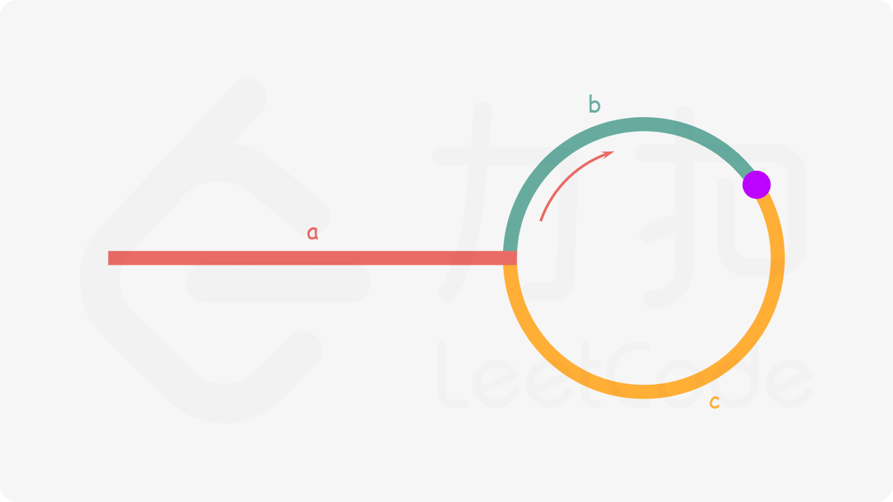

## 常见题目

### 876. 链表的中间结点

[题目链接](https://leetcode-cn.com/problems/middle-of-the-linked-list/)

> 给定一个头结点为 head 的非空单链表，返回链表的中间结点。
> 如果有两个中间结点，则返回第二个中间结点。

```java
class Solution {
    public ListNode middleNode(ListNode head) {
        ListNode slow = head, fast = head;
        while (fast != null && fast.next != null) {
            slow = slow.next;
            fast = fast.next.next;
        }
        return slow;
    }
}
```

### 83. 删除排序链表中的重复元素

[题目链接](https://leetcode-cn.com/problems/remove-duplicates-from-sorted-list/)

> 给定一个排序链表，删除所有重复的元素，使得每个元素只出现一次。

```java
class Solution {
    public ListNode deleteDuplicates(ListNode head) {
        ListNode node = head;
        while (node != null && node.next != null) {
            if (node.val == node.next.val) {
                node.next = node.next.next;
            } else {
                node = node.next;
            }
        }
        return head;
    }
}
```

### 82. 删除排序链表中的重复元素 II

[题目链接](https://leetcode-cn.com/problems/remove-duplicates-from-sorted-list-ii/)

> 给定一个排序链表，删除所有含有重复数字的节点，只保留原始链表中 _没有重复出现_ 的数字。

```java
class Solution {
    public ListNode deleteDuplicates(ListNode head) {
        ListNode first = new ListNode(-1);
        first.next = head;
        ListNode node = first;
        while (node.next != null && node.next.next != null) {
            if (node.next.val == node.next.next.val) {
                int temp = node.next.val;
                while (node.next != null && node.next.val == temp) {
                    node.next = node.next.next;
                }
            } else {
                node = node.next;
            }
        }
        return first.next;
    }
}
```

### 206. 反转链表

[题目链接](https://leetcode-cn.com/problems/reverse-linked-list/)

> 反转一个单链表。

有两种思路，我比较喜欢第一种，遍历所有结点，重新 **头插** 到新的头结点上就实现了逆序。

- 方法一

```java
class Solution {
    public ListNode reverseList(ListNode head) {
        ListNode first = new ListNode(-1);
        ListNode node = head;
        while (node != null) {
            ListNode temp = node.next;
            node.next = first.next;
            first.next = node;
            node = temp;
        }
        return first.next;
    }
}
```

- 方法二

```java
class Solution {
    public ListNode reverseList(ListNode head) {
        ListNode prev = null, cur = head, temp;
        while (cur != null) {
            temp = cur.next;
            cur.next = prev;
            prev = cur;
            cur = temp;
        }
        return prev;
    }
}
```

### 92. 反转链表 II

[题目链接](https://leetcode-cn.com/problems/reverse-linked-list-ii/)

> 反转从位置 m 到 n 的链表。请使用一趟扫描完成反转。

```java
class Solution {
    public ListNode reverseBetween(ListNode head, int m, int n) {
        ListNode dummy = new ListNode(-1);
        dummy.next = head;
        ListNode first = dummy;
        // 把 first 固定在要反转部分的前驱
        for (int i = 1; i < m; ++i) {
            first = first.next;
        }
        // 在 first 做 “头插” 实现反转
        ListNode cur = first.next, temp;
        for (int i = m; i < n; ++i) {
            temp = cur.next;
            cur.next = temp.next;
            temp.next = first.next;
            first.next = temp;
        }
        return dummy.next;
    }
}
```

### 21. 合并两个有序链表

[题目链接](https://leetcode-cn.com/problems/merge-two-sorted-lists/)

> 将两个升序链表合并为一个新的 **升序** 链表并返回。新链表是通过拼接给定的两个链表的所有节点组成的。

```java
class Solution {
    public ListNode mergeTwoLists(ListNode l1, ListNode l2) {
        ListNode dummy = new ListNode(-1);
        ListNode cur = dummy;
        while (l1 != null && l2 != null) {
            if (l1.val < l2.val) {
                cur.next = l1;
                l1 = l1.next;
            } else {
                cur.next = l2;
                l2 = l2.next;
            }
            cur = cur.next;
        }
        cur.next = l1 != null ? l1 : l2;
        return dummy.next;
    }
}
```

### 86. 分隔链表

[题目链接](https://leetcode-cn.com/problems/partition-list/)

> 给定一个链表和一个特定值 x，对链表进行分隔，使得所有小于 x 的节点都在大于或等于 x 的节点之前。

```java
class Solution {
    public ListNode partition(ListNode head, int x) {
        ListNode beforeDummy = new ListNode(-1);
        ListNode afterDummy = new ListNode(-1);
        ListNode before = beforeDummy, after = afterDummy;
        ListNode cur = head;
        while (cur != null) {
            if (cur.val < x) {
                before.next = cur;
                before = before.next;
            } else {
                after.next = cur;
                after = after.next;
            }
            cur = cur.next;
        }
        after.next = null;
        before.next = afterDummy.next;
        return beforeDummy.next;
    }
}
```

### 148. 排序链表

[题目链接](https://leetcode-cn.com/problems/sort-list/)

> 给你链表的头结点 `head` ，请将其按 **升序** 排列并返回 **排序后的链表** 。

思路：归并排序

```java
class Solution {
    public ListNode sortList(ListNode head) {
        return mergeSort(head);
    }

    public ListNode mergeSort(ListNode head) {
        if (head == null || head.next == null) {
            return head;
        }
        ListNode mid = middleNode(head);
        ListNode temp = mid.next;
        mid.next = null;
        ListNode left = mergeSort(head);
        ListNode right = mergeSort(temp);
        return mergeTwoLists(left, right);
    }

    public ListNode middleNode(ListNode head) {
        ListNode slow = head, fast = head;
        while (fast.next != null && fast.next.next != null) {
            slow = slow.next;
            fast = fast.next.next;
        }
        return slow;
    }

    public ListNode mergeTwoLists(ListNode l1, ListNode l2) {
        ListNode dummy = new ListNode(-1);
        ListNode cur = dummy;
        while (l1 != null && l2 != null) {
            if (l1.val < l2.val) {
                cur.next = l1;
                l1 = l1.next;
            } else {
                cur.next = l2;
                l2 = l2.next;
            }
            cur = cur.next;
        }
        cur.next = l1 != null ? l1 : l2;
        return dummy.next;
    }
}
```

### 143. 重排链表

[题目链接](https://leetcode-cn.com/problems/reorder-list/)

> 给定一个单链表 $L:\quad L_0\rightarrow L_1\rightarrow ...\rightarrow L_{n-1}\rightarrow L_n$ ，
>
> 将其重新排列后变为： $L_0\rightarrow L_n\rightarrow L_1\rightarrow L_{n-1}\rightarrow L_2\rightarrow L_{n-2}\rightarrow ...$

这题就是个大融合

- 找中点
- 反转
- 合并

全用上了

```java
class Solution {
    public void reorderList(ListNode head) {
        if (head == null) {
            return;
        }
        ListNode mid = middleNode(head);
        ListNode temp = mid.next;
        mid.next = null;
        temp = reverseList(temp);
        head = mergeTwoLists(head, temp);
    }

    public ListNode middleNode(ListNode head) {
        ListNode slow = head, fast = head;
        while (fast.next != null && fast.next.next != null) {
            slow = slow.next;
            fast = fast.next.next;
        }
        return slow;
    }

    public ListNode reverseList(ListNode head) {
        ListNode dummy = new ListNode(-1);
        ListNode cur = head;
        while (cur != null) {
            ListNode temp = cur.next;
            cur.next = dummy.next;
            dummy.next = cur;
            cur = temp;
        }
        return dummy.next;
    }

    public ListNode mergeTwoLists(ListNode l1, ListNode l2) {
        ListNode dummy = new ListNode(-1);
        ListNode cur = dummy;
        while (l1 != null && l2 != null) {
            cur.next = l1;
            l1 = l1.next;
            cur = cur.next;
            cur.next = l2;
            l2 = l2.next;
            cur = cur.next;
        }
        cur.next = l1 != null ? l1 : l2;
        return dummy.next;
    }
}
```

### 141. 环形链表

[题目链接](https://leetcode-cn.com/problems/linked-list-cycle/)

> 给定一个链表，判断链表中是否有环。

很典型的快慢指针题。

:::warning
不能用 `val` 比较
:::

```java
public class Solution {
    public boolean hasCycle(ListNode head) {
        if (head == null) {
            return false;
        }
        ListNode slow = head, fast = head.next;
        while (fast != null && fast.next != null) {
            if (slow == fast) {
                return true;
            }
            slow = slow.next;
            fast = fast.next.next;
        }
        return false;
    }
}
```

### 142. 环形链表 II

[题目链接](https://leetcode-cn.com/problems/linked-list-cycle-ii/)

> 给定一个链表，返回链表开始入环的第一个节点。 如果链表无环，则返回 null。

不太喜欢做这种题，好好的链表题变成了公式推导。



下面公式推导中描述的**距离**，指的都是从起点开始顺时针绕环到达某点的距离。（也就是无论在环上绕几圈，距离都不变）

- 慢指针从起点到相遇点走过的路程 $slow = a + b$
- 快指针从起点到相遇点走过的路程 $fast = a + n \times (b + c) + b$ 因为走太快，所以需要绕环 n 圈
- 因为快指针的速度是慢指针两倍，所以 $slow \times 2 = fast$
- 化简得 $a = c + (n - 1) \times (b + c)$，因为绕环对**距离**没有影响，所以得 $a = c$

最后也就得到了这题神奇的操作，快慢指针相遇后，慢指针（或者快指针也行）回到起点，快慢指针一起一步一步往前走，再一次相遇就是入环点。

```java
public class Solution {
    public ListNode detectCycle(ListNode head) {
        ListNode slow = head, fast = head;
        while (fast != null && fast.next != null) {
            slow = slow.next;
            fast = fast.next.next;
            if (slow == fast) {
                slow = head;
                while (slow != fast) {
                    slow = slow.next;
                    fast = fast.next;
                }
                return slow;
            }
        }
        return null;
    }
}
```

最后还有一种好理解一点的解法，用 Set 判断是否是入环点

```java
public class Solution {
    public ListNode detectCycle(ListNode head) {
        ListNode node = head;
        Set<ListNode> set = new HashSet<>();
        while (node != null) {
            if (set.contains(node)) {
                return node;
            }
            set.add(node);
            node = node.next;
        }
        return null;
    }
}
```

### 234. 回文链表

[题目链接](https://leetcode-cn.com/problems/palindrome-linked-list/)

> 请判断一个链表是否为回文链表。

又是一个大融合，思路很简单，从中点把链表断成两段，反转后半段，然后比较两段是否相同。

- 找中点
- 反转

```java
class Solution {
    public boolean isPalindrome(ListNode head) {
        if (head == null) {
            return true;
        }
        ListNode mid = middleNode(head);
        ListNode temp = mid.next;
        mid.next = null;
        temp = reverseList(temp);
        ListNode p1 = head, p2 = temp;
        boolean result = true;
        while (p1 != null && p2 != null) {
            if (p1.val != p2.val) {
                result = false;
                break;
            }
            p1 = p1.next;
            p2 = p2.next;
        }
        mid.next = reverseList(temp);
        return result;
    }

    public ListNode middleNode(ListNode head) {
        ListNode slow = head, fast = head;
        while (fast.next != null && fast.next.next != null) {
            slow = slow.next;
            fast = fast.next.next;
        }
        return slow;
    }

    public ListNode reverseList(ListNode head) {
        ListNode dummy = new ListNode(-1);
        ListNode cur = head;
        while (cur != null) {
            ListNode temp = cur.next;
            cur.next = dummy.next;
            dummy.next = cur;
            cur = temp;
        }
        return dummy.next;
    }
}
```

### 138. 复制带随机指针的链表

[题目链接](https://leetcode-cn.com/problems/copy-list-with-random-pointer/)

> 给定一个链表，每个节点包含一个额外增加的随机指针，该指针可以指向链表中的任何节点或空节点。
> 要求返回这个链表的 **深拷贝**。

简单粗暴的 map

```java
class Solution {
    public Node copyRandomList(Node head) {
        Node node = head;
        Map<Node, Node> map = new HashMap<>();
        while (node != null) {
            map.put(node, new Node(node.val));
            node = node.next;
        }
        node = head;
        while (node != null) {
            map.get(node).next = map.get(node.next);
            map.get(node).random = map.get(node.random);
            node = node.next;
        }
        return map.get(head);
    }
}
```

常规思路，先克隆出节点，插在原链表之中，然后再分别处理 random 和 next。（模拟了上面的 Map）

```java
class Solution {
    public Node copyRandomList(Node head) {
        if (head == null) {
            return null;
        }
        Node node = head;
        while (node != null) {
            Node clone = new Node(node.val);
            clone.next = node.next;
            node.next = clone;
            node = node.next.next;
        }
        node = head;
        while (node != null) {
            if (node.random != null) {
                node.next.random = node.random.next;
            }
            node = node.next.next;
        }
        node = head;
        Node cloneHead = head.next;
        while (node != null && node.next != null) {
            Node temp = node.next;
            node.next = temp.next;
            node = temp;
        }
        return cloneHead;
    }
}
```

## 总结

学数据结构最忌讳的就是死记硬背，有些转换过程抽象难理解的完全可以在纸上画一画，打些草稿。

重要知识点：

- null 异常处理
- dummy node 哑巴节点
- 快慢指针（寻找中间点、判断环）
- 插入一个节点到排序链表
- 从一个链表中移除一个节点
- 翻转链表
- 合并两个链表
- 找到链表的中间节点
